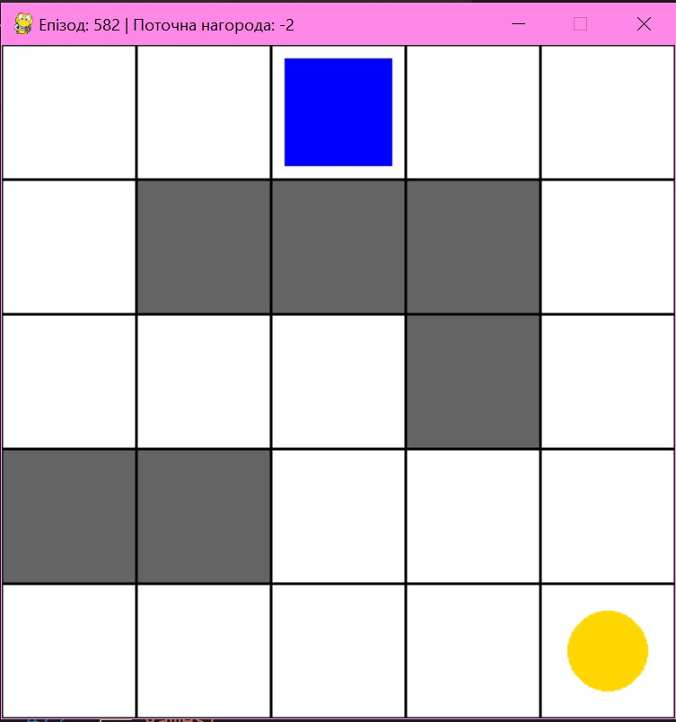
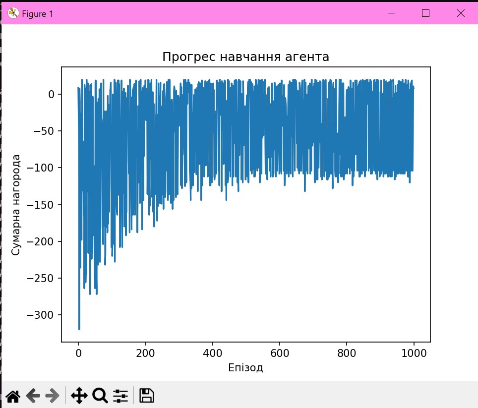

# Winter School 2026: Reinforcement Learning & Prompt Engineering ❄️🤖

## 🎮 Implemented Projects

### 1. Grid Coin Collector (Q-Learning)

An agent learns to find a coin on a $5 \times 5$ grid while navigating around obstacles.

- **Algorithm:** Q-Learning (Value-Based).
- **Rewards:** `+20` for the coin, `-5` for hitting a wall, `-1` per step.
- **Feature:** Saving the trained Q-table into a `.npy` file for persistent intelligence.

### 2. RL Chess Environment

An advanced environment for training a chess-playing AI.

- **Logic:** `python-chess` library.
- **Visualization:** Custom Pygame renderer using color-coded letters for pieces.
- **State:** $8 \times 8$ matrix representation suitable for Deep Learning (DQN).

---

## 💻 Tech Stack

- **Language:** Python 3.10+
- **Libraries:** `pygame`, `numpy`, `python-chess`
- **Local Models:** Code generated using LLMs via LM Studio / Ollama.

---

## 🚀 Getting Started

### Install Dependencies:

```bash
pip install pygame numpy python-chess
Run Agent Training (Grid Game):
Bash
python train_agent.py
Run Chess Demonstration:
Bash
python chess_self_play.py

### 📂 Repository Structure
Plaintext
winter-school-repo/
├── games/
│   ├── grid_env.py       # Environment with walls and rewards
│   └── chess_env.py      # Chess environment with letter-based rendering
├── train_agent.py        # Q-Learning agent training with visualization
├── chess_self_play.py    # Demonstration of random moves in chess (Inference)
├── q_table_walls.npy     # Saved intelligence of your trained agent
└── README.md             # This file
```

